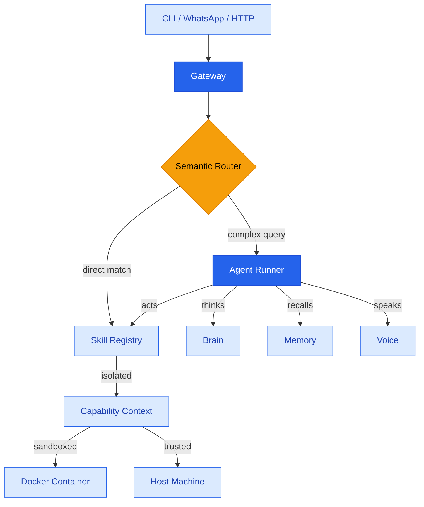

<p align="center">
  
</p>

# OpenMoose

**The local-first AI assistant that doesn't charge you by the antler.**

OpenMoose is a privacy-first AI assistant that runs entirely on your machine. It combines semantic intent routing, local vector memory, sandboxed code execution, and WhatsApp integration into a single gateway you control.

## TL;DR

```bash
git clone https://github.com/OpenMoose/openmoose.git && cd openmoose
cp .env.example .env    # configure LLM provider, ports, etc.
./setup.sh              # pulls Docker images, AI models, TTS, and deps
pnpm gateway            # start the gateway (terminal 1)
pnpm dev talk           # interactive chat (terminal 2)
```

Local LLM via node-llama-cpp. Sandboxed code execution. Vector memory. WhatsApp. Voice. Extensible YAML skills. Zero cloud dependency.

## Features

- **Local Brain** -- Powered by an integrated local engine (`node-llama-cpp`, Ministral-8B Reasoning default) or [Mistral AI](https://mistral.ai) cloud. All conversations stay on your hardware when running locally.
- **Semantic Routing** -- Common intents (time, weather, messaging) are matched instantly via local embeddings (Transformers.js), bypassing the LLM entirely for zero-latency responses.
- **Vector Memory** -- Long-term memory backed by [LanceDB](https://lancedb.com). Stores facts from conversations and indexes your local Markdown documents using local embeddings.
- **Secure Sandbox** -- All code execution happens inside hardened Docker containers with stdin-piped execution (injection-immune), `no-new-privileges` kernel security, PID limits (fork-bomb protection), and a 5MB output cap.
- **WhatsApp Integration** -- Chat with your assistant through WhatsApp. Responds to DMs automatically and to group messages prefixed with "moose".
- **Voice Output** -- Text-to-speech via Supertonic 2 ONNX models (167x faster than real-time, 10 voice styles, 5 languages).
- **Extensible Skills** -- Add capabilities with simple YAML files. [**Read the Skills Guide**](docs/SKILLS_GUIDE.md).
- **Task Scheduling** -- Schedule recurring tasks with cron expressions, intervals, or one-time execution.
- **Multi-step Reasoning** -- Complex queries are automatically decomposed into atomic actions and executed sequentially with context accumulation.

## Prerequisites

| Requirement | Version | Purpose |
|---|---|---|
| [Node.js](https://nodejs.org) | >= 20.0.0 | Runtime |
| [Docker](https://docker.com) | Latest | Sandbox execution |
| [git-lfs](https://git-lfs.com) | Latest | TTS model download |
| [pnpm](https://pnpm.io) | Latest | Package manager |
| [CMake](https://cmake.org) | >= 3.10 | Required for GPU build (Linux) |

## Hardware Acceleration (NVIDIA/CUDA)

To enable GPU acceleration on Linux (Ubuntu), you need the NVIDIA driver and the CUDA toolkit:

```bash
# 1. Install NVIDIA drivers (if not present)
sudo ubuntu-drivers install
sudo reboot

# 2. Install build tools and CUDA toolkit
sudo apt install cmake build-essential nvidia-cuda-toolkit
```

In your `.env` file, set:
```bash
LLAMA_CPP_GPU=cuda
```

## Quick Start

### 1. Clone and set up

```bash
git clone https://github.com/OpenMoose/openmoose.git
cd openmoose
cp .env.example .env
./setup.sh
```

The setup script pulls Docker images, downloads AI models, and installs dependencies.

### 2. Start the gateway

```bash
pnpm gateway
```

The gateway starts an HTTP/WebSocket server on port `18789` and initializes all services (brain, memory, WhatsApp, scheduler, TTS).

### 3. Chat

Open a new terminal:

```bash
# One-shot message
pnpm dev chat "what time is it?"

# Interactive conversation
pnpm dev talk

# With voice output
pnpm dev chat "hello" --voice
```

### 4. Run with Docker Compose (Alternative)

If you prefer to run the gateway in a containerized environment:

```bash
cp .env.example .env
docker compose up -d
```

The gateway will be accessible at `http://localhost:18789`. Your models and vector data are persisted in `./models` and `./.moose`.

## Usage

### CLI Commands

| Command | Description |
|---|---|
| `pnpm gateway` | Start the gateway server |
| `pnpm dev chat <message>` | Send a one-shot message |
| `pnpm dev talk` | Start interactive conversation mode |
| `pnpm auth` | Link your WhatsApp account (QR code) |

### CLI Options

| Option | Description |
|---|---|
| `-p, --port <number>` | Gateway port (default: `18789`) |
| `-v, --voice` | Enable voice output (TTS) |

### WhatsApp

1. Run `pnpm auth` and scan the QR code with your phone.
2. Start the gateway with `pnpm gateway`.
3. Send a DM to yourself or trigger in groups with "moose \<message\>".

Contacts are auto-learned from incoming messages and synced from your WhatsApp history.

## Configuration

Copy `.env.example` to `.env` and customize:

```bash
# Gateway
GATEWAY_PORT=18789              # HTTP/WebSocket server port
GATEWAY_SHUTDOWN_TIMEOUT_MS=10000 # Max time for graceful cleanup (ms)

# LLM Provider ('node-llama-cpp' for local, 'mistral' for cloud)
LLM_PROVIDER=node-llama-cpp

# Local LLM (node-llama-cpp)
LLAMA_CPP_MODEL_PATH=models/llama-cpp/ministral-8b-reasoning-q4km.gguf
LLAMA_CPP_GPU=auto              # 'auto', 'cuda', 'metal', 'vulkan', or 'false'

# Mistral AI (cloud)
MISTRAL_MODEL=mistral-large-latest
MISTRAL_API_KEY=your-key-here

# Text-to-Speech
TTS_LANG=en                     # en, ko, es, pt, fr
TTS_STEPS=2                     # Inference steps (2 is fast and good)
TTS_SPEED=1.05                  # Playback speed multiplier

# Memory
MEMORY_DB_PATH=.moose/memory    # Vector database location

# Logging
LOG_LEVEL=info                  # debug, info, warn, error
LOG_SILENT=false                # Suppress all output
```

## Custom Skills

Add capabilities by creating YAML files in the `skills/` directory. Skills are automatically loaded on gateway startup and registered with the semantic router. For a complete walkthrough on building your own, see the [**Custom Skills Guide**](docs/SKILLS_GUIDE.md).

### Example: Weather Skill

```yaml
name: weather
description: Get current weather for a city
examples:
  - "weather in berlin"
  - "what's the weather like in tokyo"
  - "vad är vädret i malmö"
args:
  city:
    patterns:
      - "weather (?:in|for|at) ([a-zA-ZåäöÅÄÖ\\s]+)"
      - "how is the weather in ([a-zA-ZåäöÅÄÖ\\s]+)"
      - "(?:vädret|väder) (?:i|för) ([a-zA-ZåäöÅÄÖ\\s]+)"
    fallback: Stockholm
command: "{{open}} \"https://wttr.in/{{city|u}}?format=3\""
host: true
```

### Skill fields

| Field | Required | Description |
|---|---|---|
| `name` | Yes | Unique identifier |
| `description` | Yes | Human-readable purpose |
| `examples` | Yes | Phrases that trigger this skill (used for semantic matching) |
| `args` | No | Named arguments extracted via regex patterns |
| `command` | Yes | Shell command with `{{arg}}` placeholders |
| `host` | No | Run on host (`true`) or in Docker sandbox (`false`, default). Host mode requires dependencies (like `python3` or `curl`) to be installed on the local system. |
| `image` | No | Custom Docker image for sandboxed execution |

### Placeholders

| Syntax | Description |
|---|---|
| `{{arg}}` | Direct substitution |
| `{{arg\|u}}` | URL-encoded substitution |
| `{{open}}` | OS-specific open command (`open`, `start`, or `xdg-open`) |
| `{{context}}` | Result from a previous step |

## Built-in Tools

The LLM has access to these tools for complex tasks:

| Tool | Description |
|---|---|
| `python_execute` | Run Python 3.12 code in a Docker sandbox |
| `shell_execute` | Run bash commands in a Docker sandbox |
| `memory_store` | Store a fact in long-term memory |
| `memory_recall` | Semantic search over stored memories |
| `read` | Read file contents from the filesystem |
| `ls` | List directory contents |
| `file_write` | Create or overwrite files |
| `browser_action` | Automate browsers via Playwright (navigation, interaction, and snapshots) |

> **Privacy Warning**: While OpenMoose runs LLMs locally, some skills (like `weather` or `YouTube`) call external APIs or URLs. This can leak your IP address or query data to third parties. Audit your `.yaml` skills if you require 100% air-gapped isolation.

## Architecture



### Project Structure

```
src/
├── gateway/        Central HTTP/WebSocket server
├── agents/         LLM brain and prompt construction
├── runtime/        Skill registry, runner, router, scheduler
│   └── skills/     Dynamic plugins (builtins & custom)
├── infra/          Memory, sandbox, audio, WhatsApp, logging
├── cli/            Command-line interface
└── config/         Centralized configuration
skills/             YAML-based portable skill definitions
models/             TTS model files (Supertonic 2)
docs/               Markdown documents indexed into memory
```

## Security

All code execution is sandboxed with defense-in-depth:

- **Read-only root filesystem** (`--read-only`)
- **Stdin-Piped Execution** -- Code (Python/Node) is streamed via stdin, neutralizing shell-injection and `arg_max` limits.
- **Kernel-Level Restrictions** -- `--security-opt=no-new-privileges` and `--pids-limit 50` prevent escalation and fork-bombing.
- **Output Exhaustion Protection** -- Strict **5MB cap** on `stdout/stderr` prevents host OOM crashes.
- **Dropped dangerous capabilities** (`NET_RAW`, `MKNOD`, `AUDIT_WRITE`, etc.)
- **Non-root user** (`--user 1000:1000`)
- **Resource limits** (memory, CPU, timeout)
- **Structural Integrity** -- Core skills are verified via a centralized `manifest.ts` enforcing filename/name parity.
- **DevOps Transparency** -- Containers use versioned reverse-DNS labels (e.g., `com.openmoose.app=true`, `com.openmoose.version=1`).

## Security Maturity Disclosure

OpenMoose is a developer-first tool. For production-grade or multi-tenant deployments, please be aware of these architectural boundaries:

- **Docker Socket Risk**: The gateway requires access to the Docker daemon. In standard configurations, this grants the Node.js process the same privileges as the `docker` group. For high-risk environments, we recommend running in **Rootless Docker** or **Podman**.
- **Upstream SHA Pinning**: By default, we use semantic tags (e.g., `python:3.12-slim`). For immutable supply-chain security, we recommend pinning Docker images by SHA256 digest in your local `.env`.
- **Tmpfs Capping**: All sandbox temporary storage is capped at **64MB** to prevent RAM exhaustion on the host machine.
- **Taxonomy**: Whether you call it an **OpenMoose** or a **Titanium Elk**, the security primitives remain identical.

## Transparency & FAQ

**Why the Gateway?** 
The Gateway is a central "brain" that allows multiple clients (WhatsApp, CLI, Web) to share the same local LLM context and memory. It is the core of the multi-device experience.

**Can I run without the Gateway?**
Yes. For pure local testing or "one-off" chats, you can use the standalone CLI:
```bash
pnpm dev chat "hello"
```
This bypasses the Gateway server and runs the logic directly in the process.

**What about 3rd-party data?**
OpenMoose does not phone home. However, if a skill command includes a URL (e.g., `wttr.in`), your machine will fetch that URL. Always check a skill's `command` field to see where it connects.

## Known Limitations

- **Semantic Drift**: The router uses vector similarity. Very rarely, a request for "fire the rockets" might trigger "get the thermostat" if the embeddings overlap in a weird way.
- **Resource Heavy**: Browser automation via Playwright requires significant RAM (2GB+ per daemon).
- **Cleanup Latency**: Container cleanup on shutdown can take up to 10 seconds. You can tune `GATEWAY_SHUTDOWN_TIMEOUT_MS` if your system is particularly slow.
- **Docker Storage**: OpenMoose does not automatically prune old images. Run `docker image prune` occasionally to reclaim disk space.

## Scripts

| Script | Description |
|---|---|
| `pnpm gateway` | Start the gateway server |
| `pnpm dev` | CLI interface |
| `pnpm auth` | WhatsApp QR authentication |
| `pnpm build` | Compile TypeScript to `dist/` |
| `pnpm lint` | Run ESLint |
| `pnpm lint:fix` | Auto-fix lint issues |
| `pnpm test` | Run tests with Vitest |
| `./setup.sh` | Full environment setup |
| `./reset.sh` | Wipe vector memory |

## License

This project is licensed under the MIT License - see the [LICENSE](LICENSE) file for details.

### Logo & Trademark

The OpenMoose logo (`openmoose.svg`) was created by Petter, 7 years old. It is **not** covered by the MIT license. You may not use the logo for commercial purposes or in a way that implies endorsement by OpenMoose without explicit permission.

## Credits

OpenMoose is built on these open-source projects and models:

### Runtime Dependencies

| Package | License | Commercial | Description |
|---|---|---|---|
| [@hapi/boom](https://hapi.dev) | BSD-3-Clause | Yes | HTTP error utilities |
| [Apache Arrow](https://arrow.apache.org) | Apache-2.0 | Yes | Columnar data format (LanceDB dependency) |
| [Baileys](https://github.com/WhiskeySockets/Baileys) | MIT | Yes | WhatsApp Web API |
| [Chalk](https://github.com/chalk/chalk) | MIT | Yes | Terminal colors |
| [Commander](https://github.com/tj/commander.js) | MIT | Yes | CLI framework |
| [cron-parser](https://github.com/harrisiirak/cron-parser) | MIT | Yes | Cron expression parsing |
| [dotenv](https://github.com/motdotla/dotenv) | BSD-2-Clause | Yes | Environment variable loading |
| [Hono](https://hono.dev) | MIT | Yes | Web framework |
| [js-yaml](https://github.com/nodeca/js-yaml) | MIT | Yes | YAML parsing |
| [LanceDB](https://lancedb.com) | Apache-2.0 | Yes | Vector database |
| [node-llama-cpp](https://node-llama-cpp.js.org/) | MIT | Yes | Integrated LLM engine |
| [@huggingface/transformers](https://huggingface.co/docs/transformers.js) | Apache-2.0 | Yes | Integrated embeddings engine |
| [ONNX Runtime](https://onnxruntime.ai) | MIT | Yes | ML inference engine (TTS) |
| [Ora](https://github.com/sindresorhus/ora) | MIT | Yes | Terminal spinners |
| [Pino](https://getpino.io) | MIT | Yes | Logger |
| [qrcode](https://github.com/soldair/node-qrcode) | MIT | Yes | QR code generation |
| [qrcode-terminal](https://github.com/gtanner/qrcode-terminal) | Apache-2.0 | Yes | Terminal QR display |
| [ws](https://github.com/websockets/ws) | MIT | Yes | WebSocket server |
| [Zod](https://zod.dev) | MIT | Yes | Schema validation |

### Models

| Model | License | Commercial | Description |
|---|---|---|---|
| [Ministral-8B Reasoning](https://huggingface.co/mistralai/Ministral-3-8B-Reasoning-2512-GGUF) | Apache-2.0 | Yes | Default LLM (integrated GGUF) |
| [all-MiniLM-L6-v2](https://huggingface.co/xenova/all-MiniLM-L6-v2) | Apache-2.0 | Yes | Embedding model (integrated) |
| [Supertonic 2](https://huggingface.co/Supertone/supertonic-2) | Open RAIL-M | Conditional | Text-to-speech (ONNX) |

### Dev Dependencies

| Package | License | Commercial | Description |
|---|---|---|---|
| [ESLint](https://eslint.org) | MIT | Yes | Linter |
| [tsx](https://github.com/privatenumber/tsx) | MIT | Yes | TypeScript execution |
| [TypeScript](https://www.typescriptlang.org) | Apache-2.0 | Yes | Language |
| [Vitest](https://vitest.dev) | MIT | Yes | Test framework |

---

*Built with pride by the OpenMoose contributors.*
